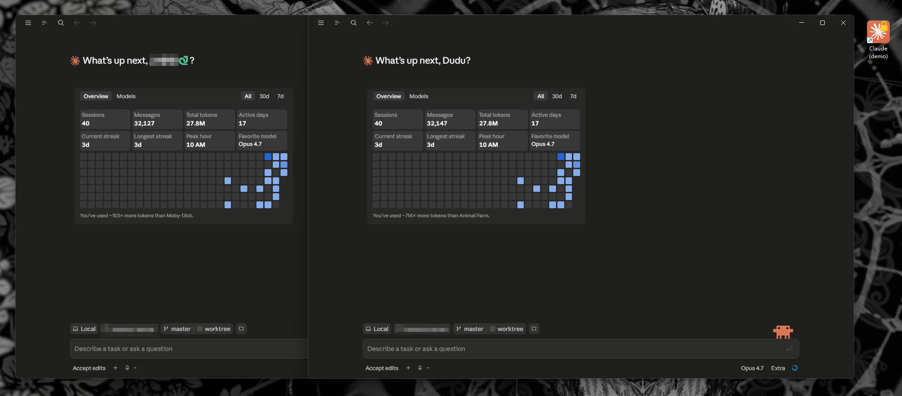

# Claude Desktop Dual Launcher (Windows)



Run **two (or more) Claude Desktop accounts side by side** on Windows — each
with its own login, chat history, and local state. Useful when you have two
Pro subscriptions, want a clean work/personal split, or you've hit a usage
limit and want to switch to your other account without logging out.

> **Platform:** Windows only (v1). macOS/Linux support is on the roadmap — the
> underlying technique works there too, but the paths and shortcut mechanics
> differ.

> **TL;DR of the trick:** Claude Desktop is an Electron app. Electron honors
> `--user-data-dir=<path>` to redirect all per-user state (OAuth tokens, chat
> history, window state) into a separate directory. Launching Claude with a
> custom `user-data-dir` creates an independent instance. Same technique used by
> Discord, Slack, VS Code, etc.

---

## Install (as a Claude Code skill)

If you use [Claude Code](https://claude.com/claude-code) (the CLI/desktop coding
agent), drop this whole folder into your skills directory:

```powershell
# from inside the cloned repo:
$dest = "$env:USERPROFILE\.claude\skills\claude-desktop-dual-launcher"
New-Item -ItemType Directory -Path $dest -Force | Out-Null
Copy-Item -Path ".\*" -Destination $dest -Recurse -Force
```

Then in any Claude Code session, ask the agent something like:

> *"Set up a second Claude Desktop instance for my work account."*

The skill auto-triggers, asks for an instance name, runs the setup, and reports
back. You can also invoke it directly: `/claude-desktop-dual-launcher work`.

## Install (standalone, without Claude Code)

Just clone the repo and run the PowerShell script directly:

```powershell
git clone https://github.com/VITASID57/Claude-code-desktop-dual-launcher.git
cd Claude-code-desktop-dual-launcher
powershell -ExecutionPolicy Bypass -File .\scripts\setup.ps1 -InstanceName "work"
```

That's it. A blank Claude window opens for you to log in with the second
account, and a `Claude (work).lnk` shortcut appears on your desktop.

---

## What it creates

After running `setup.ps1 -InstanceName work`:

**Per-instance:**

| Path | Purpose |
|---|---|
| `%APPDATA%\Claude-work\` | The new instance's user-data-dir (OAuth, chat history, etc.) |
| `Desktop\Claude (work).lnk` | Desktop shortcut targeting `current\Claude.exe` (through the junction below) |

**Shared infrastructure (created once, reused by all instances):**

| Path | Purpose |
|---|---|
| `%USERPROFILE%\.claude-dual-launcher\current\` | NTFS junction → `<latest>\Claude_*\app\` |
| `%USERPROFILE%\.claude-dual-launcher\refresh-junction.bat` | Re-points the junction at the newest installed Claude |
| Task Scheduler: `ClaudeDualLauncher-JunctionRefresh` | Runs the .bat on every user logon |

The original Claude Desktop (launched from the Start menu / pinned taskbar
icon) is unchanged — it keeps using the default `%APPDATA%\Claude\`.

## Usage

- **Original account**: open Claude Desktop the normal way (Start menu / taskbar).
- **Second account**: double-click `Claude (work).lnk` on the desktop.
- **Both at once**: do both. They are completely independent processes.

You can also log out / log in inside each instance freely. The "instance" is
just an isolated storage location; which account is logged into it is up to you.

> ⚠️ **Don't log in to the same account in both instances simultaneously.**
> Anthropic's sessions list will show two clients online for one account, which
> may trigger a security/risk review.

## When Claude Desktop updates

**You don't have to do anything.** Each shortcut targets
`%USERPROFILE%\.claude-dual-launcher\current\Claude.exe` — a path that
doesn't include the Claude version number. The `current\` directory is an
NTFS junction that's re-pointed at the newest installed `Claude_<version>\app\`
folder on every user logon by a small `.bat` script driven by Task Scheduler.

So whenever Claude auto-updates:

1. The next time you log into Windows, the logon-triggered task notices the
   new `Claude_<new-version>\` folder and re-creates the junction to point
   at it.
2. Double-clicking the desktop shortcut just works — same icon, same
   instant launch.

No PowerShell, no VBS, no scripts at click-time — so heuristic antivirus
software (Defender, 火绒, 360, etc.) doesn't flag the shortcut as suspicious.

## Adding more instances

```powershell
.\scripts\setup.ps1 -InstanceName "personal"
.\scripts\setup.ps1 -InstanceName "client-acme"
```

Each name creates an independent `Claude-<name>` data directory and its own
shortcut.

## Removing an instance

```powershell
.\scripts\uninstall.ps1 -InstanceName "work"
```

Removes the desktop shortcut and asks before deleting the user-data-dir (so
chat history isn't lost by accident). If the instance is still running,
uninstall identifies its Electron processes by command-line and offers to
stop them so the user-data-dir can be deleted.

Flags:
- `-KeepUserData` — keep chat history etc., delete only the shortcut
- `-Force` — skip prompts (use for scripting; will force-stop processes)
- `-RemoveGlobal` — also remove the shared junction, .bat, and scheduled
  task. Only pass this when removing your **last** instance.

---

## How it works under the hood

1. **Locate Claude.exe.** Claude Desktop installs as an MSIX package under
   `C:\Program Files\WindowsApps\Claude_<version>_x64__<publisher>\app\Claude.exe`.
   The setup script scans this directory and picks the newest version.

2. **Launch with `--user-data-dir`.** Despite being an MSIX-packaged app, the
   inner Electron runtime still respects command-line flags. Passing
   `--user-data-dir="C:\Users\<you>\AppData\Roaming\Claude-work"` (or any
   path you like) makes Electron use that directory for all per-user state.

3. **What lives in user-data-dir.** Things that are *per-instance*:
   - `Local Storage\leveldb\` — OAuth tokens, session state
   - `IndexedDB\` — chat history, drafts
   - `Cache\`, `Code Cache\`, `blob_storage\` — Chromium caches
   - Window position, zoom level, etc.

4. **What stays shared.** Things under `%USERPROFILE%\.claude\` (CLAUDE.md,
   MEMORY.md, plugins, skills, project settings) are **not** part of
   user-data-dir. They're shared across all instances, which is usually what
   you want — global config and the agent's memory travel with you, while
   sessions/auth are isolated.

5. **Why the junction + scheduled task.** The desktop `.lnk` cannot hardcode
   a versioned Claude.exe path — every Claude update breaks it. Earlier
   versions of this skill tried two other approaches that both failed in
   the field:

   - **v1.0** targeted `Claude.exe` directly with a version-pinned path.
     The shortcut died on every Claude update and had to be manually
     re-pointed.
   - **v1.1** targeted `powershell.exe` with `-File <self-healing-launcher.ps1>`.
     Synthetic tests passed, but real-world double-clicks were silently
     blocked by heuristic antivirus rules that flag `.lnk` command lines
     containing `powershell.exe ... -ExecutionPolicy Bypass` as a
     known living-off-the-land malware pattern. Plus the icon couldn't be
     read from the WindowsApps directory through a non-packaged-app
     activation path, so the shortcut showed a generic white "missing"
     icon. Reverted in commit [`0ed1b07`](../../commit/0ed1b07).

   **v1.2 (current)** sidesteps both pitfalls by working at the filesystem
   layer. `current\Claude.exe` is a path that doesn't change between
   versions — its target is an NTFS junction (essentially a symlink for
   directories) that gets re-pointed by a pure-cmd `.bat` driven by Task
   Scheduler on every logon. The `.lnk` itself doesn't reference PowerShell
   or scripts in any way, so AV heuristics ignore it. The `.bat` uses only
   native Windows commands (`dir`, `mklink`, `rmdir`) and the task is
   registered with `schtasks.exe` — none of these are AV-sensitive.

## FAQ

**Will this get my account banned?**
No — `--user-data-dir` is a public, supported Chromium/Electron flag, not a
hack against Anthropic's service. The only sessions-related risk is logging
in to the *same account* in multiple instances at the same time (don't do
that, as noted above).

**Does this duplicate Claude's disk usage?**
The Claude.exe binary itself is shared — only per-user state grows. Expect
~hundreds of MB per instance once you've accumulated chat history and caches.

**Can I use this with the regular Claude Code CLI (terminal-only)?**
This skill targets Claude *Desktop* specifically. The CLI handles auth
differently (via `~/.claude/.credentials.json`). If you only use the
terminal CLI, you don't need this skill.

**Does it work with Claude Desktop installed outside the Microsoft Store?**
Only the Microsoft Store / MSIX install is auto-detected in v1. If you have a
sideloaded build, you can still pass `--user-data-dir` manually — the
mechanism is the same, the path lookup is what differs.

## Roadmap

- [ ] macOS support (Claude.app + `LaunchAgent` / `open -n -a`)
- [ ] Linux support (AppImage / deb / Flatpak variants)
- [ ] List installed instances (`.\scripts\list.ps1`)
- [ ] Optional taskbar pinning helper

## License

MIT — see [LICENSE](./LICENSE).

## Contributing

PRs welcome. Especially for macOS/Linux support, additional instance-management
features, and bug reports from people with edge-case Windows installs.
